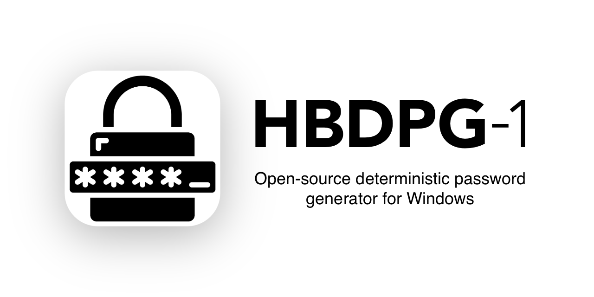

# HBDPG-1 for Windows

Lenguages: [English](#English) | [Русский](#Русский)

---

# English

> Project **"HBSPC-1"** has been renamed to **"HBDPG-1"**.

---

> [!CAUTION]
> **Do not use HBDPG-1!**
> It is <ins>not secure enough</ins>!

This project is **no longer supported!** Try the **NEXT GEN** of deterministic password generator!

**HBDPG-2** is a more secure, cross-platform deterministic password generator. [Learn more about HBDPG-2](https://github.com/HBDPG-2/hbdpg-2.github.io)

---

### Contents:
* [About](#About)
* [Risks and Recommendations](#Risks-and-Recommendations)

## About

**HBDPG-1** *(Hashing-based Deterministic Password Generator – 1st Gen)* is a hashing-based algorithm for deterministic password generation using user's passkey (passphrase).
This algorithm is designed to solve the problem of creating, remembering and storing strong passwords.

The user doesn't need to remember or save a password, it is enough for him to remember the passkey (phrase), which can be quite simple. 
The passkey can be a string of any length. The algorithm calculates a secure password 32 characters long that contains upper and lower 
case letters (A-F), numbers (0-9) and symbols.

Example:

| Passkey    | Password                           |
| ---------- | ---------------------------------- |
| password   | `266B:ea21=fCa3+B9f1?926D>e87c^61` |
| qwerty     | `5Ff^6Fe17F8{a3628Cb*22a3134%5C98` |
| 123        | `6f31\1C4Fb7b'8Ae934d}19d1935(1E5` |
| bob        | `d19d>378ec\c0Eae]7f1ce\306d5^868` |
| 01.01.1970 | `0F85"B8D4/a951_680a/3CdE^Ad27=e7` |

> [!WARNING]
> **Do not use very simple passkeys!**

The algorithm has an avalanche effect due to which even a slight change in the passkey can completely change the result.

Example:

| Passkey    | Password                           |
| ---------- | ---------------------------------- |
| secretkey  | `B0e}4cE29:23Cb1+4a0d4}fb267"51D2` |
| secretKey  | `7bc8$99B40)C462D<9f0e7*5055D#636` |
| secret key | `<8e9251}199B09^B45f55(e5504F%D55` |

> The algorithm is case and space sensitive!

## Risks and Recommendations

The main risk of using HBDPG-1 is the possibility for an attacker to enumerate simple and popular passkeys and calculate passwords. 
To avoid password compromise, **do not use too short and simple passkeys!** To complicate the brute force you can set a **larger number of iterations**, the available values: 1 – 99,999. The set number of iterations affects the result (generated password)!

**Do not store passkeys in plain text!** If there is a need to save the passkey, use encryption (for example, AES).

**Do not use identical passkeys** for passwords from different services (accounts)!

**Use 2FA** on all services if possible!

# Русский

> Проект **"HBSPC-1"** был переименован в **"HBDPG-1"**.

---

> [!CAUTION]
> **Не используйте HBDPG-1!**
> Он <ins>недостаточно безопасен</ins>!

Этот проект **больше не поддерживается!** Попробуйте **СЛЕДУЮЩЕЕ ПОКОЛЕНИЕ** детерминированного генератора паролей!

**HBDPG-2** — это более безопасный, кроссплатформенный детерминированный генератор паролей. [Узнать больше о HBDPG-2](https://github.com/HBDPG-2/hbdpg-2.github.io)

---

### Содержание:
* [Описание](#Описание)
* [Риски и Рекомендации](#Риски-и-Рекомендации)

## Описание

**HBDPG-1** *(Hashing-based Deterministic Password Generator – 1st Gen)* — это алгоритм для детерминированной генерации паролей на основе пользовательского ключа (фразы).
Данный алгоритм призван решить проблему создания, запоминания и хранения сложных паролей.

Пользователю не нужно запоминать или сохранять где-либо сложный пароль, ему достаточно запомнить ключ (фразу), который может быть довольно простым. 
Ключом может служить строка произвольной длины. Алгоритм вычисляет из ключа безопасный 32-значный пароль, который содержит буквы верхнего и нижнего 
регистра (A-F), цифры (0-9) и спецсимволы.

Пример:

| Ключ       | Пароль                             |
| ---------- | ---------------------------------- |
| password   | `266B:ea21=fCa3+B9f1?926D>e87c^61` |
| qwerty     | `5Ff^6Fe17F8{a3628Cb*22a3134%5C98` |
| 123        | `6f31\1C4Fb7b'8Ae934d}19d1935(1E5` |
| bob        | `d19d>378ec\c0Eae]7f1ce\306d5^868` |
| 01.01.1970 | `0F85"B8D4/a951_680a/3CdE^Ad27=e7` |

> [!WARNING]
> **Не используйте слишком простые ключи!**

Алгоритм обладает лавинным эффектом, благодаря чему даже незначительное изменение ключа способно полностью изменить результат.

Пример:

| Ключ       | Пароль                             |
| ---------- | ---------------------------------- |
| secretkey  | `B0e}4cE29:23Cb1+4a0d4}fb267"51D2` |
| secretKey  | `7bc8$99B40)C462D<9f0e7*5055D#636` |
| secret key | `<8e9251}199B09^B45f55(e5504F%D55` |

> Алгоритм чувствителен к регистру и пробелам!

## Риски и Рекомендации

Основным риском использования HBDPG-1 является возможность перебора злоумышленником простых и популярных ключей и вычисление из них соответствующих паролей. 
Во избежание компрометации пароля **не используйте слишком короткие и простые ключи!** Для усложнения перебора можете **установить большее количество итераций**, доступные значения: 1 – 99,999. Установленное количество итераций влияет на результат (сгенерированный пароль)!

**Не храните ключи в открытом виде!** Если есть необходимость сохранить ключ, используйте шифрование (например, AES).

**Не используйте идентичные ключи** для паролей от разных сервисов (аккаунтов)!

**Используйте двухэтапную аутентификацию** во всех сервисах, если есть возможность!
